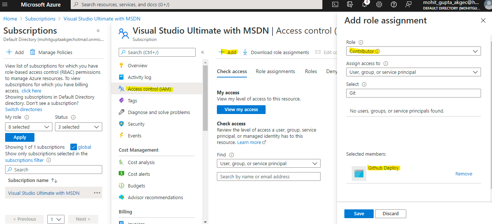
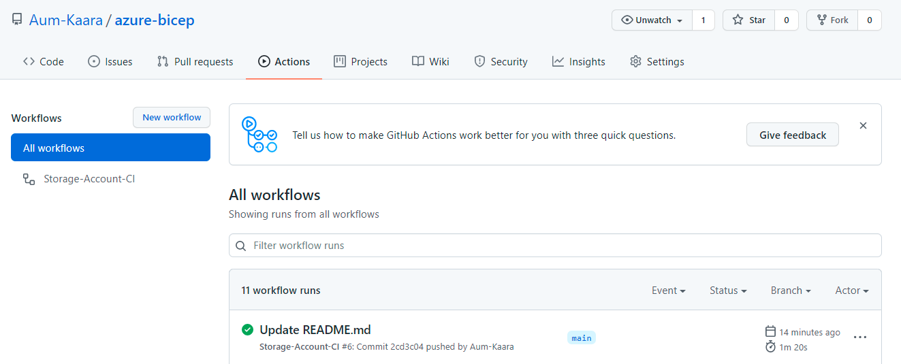
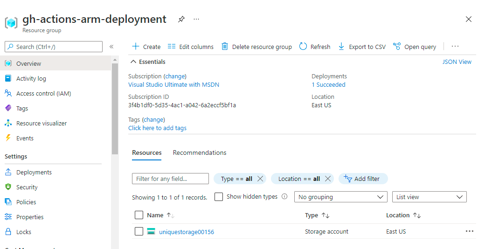

[](https://github.com/Aum-Kaara/azure-bicep/actions/workflows/WebApp-Deploy.yml)

# Deploy Azure Bicep using GitHub Actions

### Create Service Principal in Azure Active Directory


### Give Permission to service principal 



### Generate deployment credentials

```
{
    "clientId": "<GUID>",
    "clientSecret": "<GUID>",
    "subscriptionId": "<GUID>",
    "tenantId": "<GUID>",
    (...)
 }
```

### Configure the GitHub secrets

Select Settings > Secrets > New secret.

Paste the entire JSON output . Give the secret the name AZURE_CREDENTIALS.

### Add a Bicep file

```
resource stg 'Microsoft.Storage/storageAccounts@2019-06-01' = {
  name: 'uniquestorage00156' // must be globally unique
  location: 'eastus'
  kind: 'Storage'
  sku: {
    name: 'Standard_LRS'
  }
}

```

### Create workflow

From your GitHub repository, select Actions from the top menu.

  - Select New workflow.

  - Select set up a workflow yourself.
    
  - Replace with below content

```
# This is a basic workflow to help you get started with Actions

name: Storage-Account-CI

# Controls when the workflow will run
on:
  # Triggers the workflow on push or pull request events but only for the main branch
  push:
    branches: [ main ]
  pull_request:
    branches: [ main ]

  # Allows you to run this workflow manually from the Actions tab
  workflow_dispatch:

# A workflow run is made up of one or more jobs that can run sequentially or in parallel
jobs:
  # This workflow contains a single job called "build"
  build:
    # The type of runner that the job will run on
    runs-on: ubuntu-latest

    # Steps represent a sequence of tasks that will be executed as part of the job
    steps:
      # Checks-out your repository under $GITHUB_WORKSPACE, so your job can access it
      - uses: actions/checkout@v2

      - name: Azure Login
        uses: Azure/login@v1
        with:
          creds: ${{ secrets.AZURE_CREDENTIALS }}
      - name: Depoy ARM Template
        uses: azure/arm-deploy@v1
        with:
          subscriptionId: ${{ secrets.SUBSCRIPTION_ID }}
          resourceGroupName: gh-actions-arm-deployment
          template: ./storageaccount/main.bicep

```

### Run workflow from Github actions



### Verify resources on Azure portal


